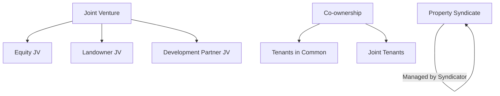

# Risks & Expert Review

This document provides a detailed analysis of ownership structures, tax and legal risks, partnership options, and protection strategies for property investment in Australia. All content should be validated by qualified financial and legal experts and updated as advice is received.

---

## Ownership Structures for Property Investment (Australia)

**Company:**

- Pays company tax rate (generally 30%, or 25% for base rate entities)
- Profits distributed to shareholders as dividends (franking credits may offset double taxation)
- Legal separation from owners; compliance with ASIC and ATO regulations
- Risks: Double taxation if profits are distributed, director duties, ongoing compliance

**Trust:**

- Income distributed to beneficiaries, taxed at their marginal rates
- Can provide asset protection and tax planning flexibility
- Requires a trustee, annual trust resolutions, and compliance with trust law
- Risks: Complex setup/administration, compliance with trust deeds and ATO rules

**Partnership:**

- Income split among partners, taxed at individual rates
- Simple structure, direct control by partners
- Partners jointly liable for debts and obligations
- Risks: Unlimited liability, disputes, compliance with partnership agreements

**Joint Venture:**

- Two or more parties collaborate on a specific project
- Taxed according to each party’s structure (company, trust, individual)
- Flexible arrangements, shared risk/reward
- Risks: Complex agreements, compliance with JV contracts, potential disputes

## Tax & Legal/Compliance Comparison Table

| Structure     | Tax Rate         | Distribution Method | Double-Taxation Risk | Legal/Compliance Risks |
|--------------|------------------|--------------------|---------------------|-----------------------|
| Company      | 25-30%           | Dividends          | Possible, offset by franking credits | ASIC/ATO compliance, director duties |
| Trust        | Beneficiary rate | Distributions      | No                  | Trustee duties, trust law compliance |
| Partnership  | Individual rate  | Profit share       | No                  | Unlimited liability, partnership agreement |
| Joint Venture| Varies           | As per agreement   | Varies              | JV contract, dispute risk |

## Partnership & Syndicate Options

Partnering with others, often through joint ventures or property syndicates, can be an effective way to build wealth through property by combining resources and expertise. However, it is a complex strategy with significant risks that require careful planning and legal agreements to protect all parties.

**Options:**

- **Joint Ventures (JV):** Formal agreement for a specific, project-based investment (e.g., renovation, development).
  - *Equity JV:* One partner provides capital, another provides expertise.
  - *Landowner JV:* Landowner provides property, developer manages construction/sales.
  - *Development Partner JV:* Multiple developers pool resources for larger projects.
- **Property Syndicates:** Group of investors pool funds to purchase property, managed by a professional syndicator. Most operate under managed investment rules for wholesale investors in Australia.
- **Co-ownership with Family/Friends:** Pooling money with trusted individuals for greater purchasing power. Common structures: tenants in common, joint tenants.

## Pros and Cons of Property Partnerships

| Partnership Aspect      | Pros  | Cons     |
|-------------------------|-------|----------|
| Financial   | Pooled funds increase buying power; shared responsibility lowers cost | All partners share risks; joint liability for debts                  |
| Expertise   | Diverse skills; reduced workload/stress                              | Disputes over management, workload imbalance                         |
| Flexibility | Access to more opportunities; diversification                        | Conflicting goals, difficult exits                                   |
| Legal       | Clear agreements define roles, profit-sharing, exit strategies       | Complex tax, stamp duty, and legal implications; survivorship issues |
| Personal    | Emotional support, shared goals                                      | Relationship breakdowns, financial stress                            |

## Protection Strategies

- Choose partners carefully (trust, aligned goals, risk tolerance)
- Establish formal legal agreements (roles, contributions, profit/loss, dispute resolution)
- Create explicit exit strategies
- Seek expert advice (property lawyer, financial adviser, mortgage broker)
- Consider ownership structure (tenants in common vs. joint tenants)
- Explore split loans for financial independence

## Partnership Structures (Mermaid Diagram)

**References:**

- [ATO: Companies](https://www.ato.gov.au/business/starting-your-own-business/business-structures/companies/)
- [ATO: Trusts](https://www.ato.gov.au/business/starting-your-own-business/business-structures/trusts/)
- [ATO: Partnerships](https://www.ato.gov.au/business/starting-your-own-business/business-structures/partnerships/)
- [ATO: Joint Ventures](https://www.ato.gov.au/business/starting-your-own-business/business-structures/joint-ventures/)
- [ASIC: Managed Investment Schemes](https://asic.gov.au/regulatory-resources/funds-management/managed-investment-schemes/)

*All structures and tax outcomes should be validated by a qualified financial/legal expert. Track status and update as advice is received.*
