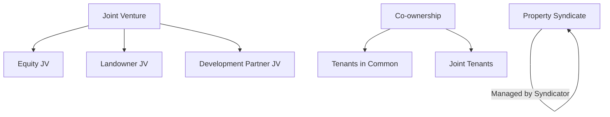

# Risks & Expert Review

This document provides a detailed analysis of ownership structures, tax and legal risks, partnership options, and protection strategies for property investment in Australia. All content should be validated by qualified financial and legal experts and updated as advice is received.

---

## Ownership Structures for Property Investment (Australia)

**Company:**

- Pays company tax rate (generally 30%, or 25% for base rate entities)
- Profits distributed to shareholders as dividends (franking credits may offset double taxation)
- Legal separation from owners; compliance with ASIC and ATO regulations
- Risks: Double taxation if profits are distributed, director duties, ongoing compliance

**Trust:**

- Income distributed to beneficiaries, taxed at their marginal rates
- Can provide asset protection and tax planning flexibility
- Requires a trustee, annual trust resolutions, and compliance with trust law
- Risks: Complex setup/administration, compliance with trust deeds and ATO rules

**Partnership:**

- Income split among partners, taxed at individual rates
- Simple structure, direct control by partners
- Partners jointly liable for debts and obligations
- Risks: Unlimited liability, disputes, compliance with partnership agreements

**Joint Venture:**

- Two or more parties collaborate on a specific project
- Taxed according to each party’s structure (company, trust, individual)
- Flexible arrangements, shared risk/reward
- Risks: Complex agreements, compliance with JV contracts, potential disputes

### Difference between partnership & joint venture

If you are considering undertaking a project (eg. property development) you might be looking for a partner to join the assets, knowledge and expertise. What business structure is most suitable for you? Careful planning ensures that a proposed structure is tax efficient. You can set up a partnership or enter into a joint venture agreement. The tax treatment of a partnership differs from a joint venture.

**Know the Difference**

A partnership is not a separate legal entity but it requires to lodge a tax return. There are certain rules related to the allowable deductions for a partnership. Partners are required to include their share of a partnership net income in their individual tax returns. An unincorporated joint venture does not lodge a tax return; instead, each joint venturer lodges a separate tax return.

To distinguish between a joint venture and a partnership the ATO would analyse the nature of the business relationship rather than relying on the wordings of the agreement. The ruling specifically states that an arrangement is a joint venture if the participants are to share product or output rather than profits or sale proceeds. Generally, a partnership is a continuing business; whereas, a joint venture is created for a specific economic project. Joint venture participants are usually liable for their own debts which they incur individually

For GST purposes separate joint venturers may be allowed to form a single group. Generally, transactions between group members are ignored for GST purposes. One entity, known as the representative member, manages the group’s GST affairs. The representative member is responsible for the GST payable and can claim the GST credits on transactions undertaken by group members (except transactions between group members). This arrangement helps to reduce administrative cost in relation to GST compliance.

The distinction between a partnership and a joint venture is vital because of the different tax implications. It’s important to seek professional advice to ensure you are adhering to the requirements. Contact The Quinn Group today on 02 9223 9166 for more information or submit an online enquiry here.

**More good reference:**

- [Difference between partnership & joint venture](https://www.quinns.com.au/blog/accounting-news/joint-venture-vs-partnership/)
- [Joint venture vs partnership: Which is right for you?](https://sprintlaw.com.au/articles/joint-venture-vs-partnership-which-is-right-for-you/)

## Tax & Legal/Compliance Comparison Table

| Structure     | Tax Rate         | Distribution Method | Double-Taxation Risk | Legal/Compliance Risks |
|--------------|------------------|--------------------|---------------------|-----------------------|
| Company      | 25-30%           | Dividends          | Possible, offset by franking credits | ASIC/ATO compliance, director duties |
| Trust        | Beneficiary rate | Distributions      | No                  | Trustee duties, trust law compliance |
| Partnership  | Individual rate  | Profit share       | No                  | Unlimited liability, partnership agreement |
| Joint Venture| Varies           | As per agreement   | Varies              | JV contract, dispute risk |

### Partner Tax Obligations

A partnership:

- has its own TFN
- must lodge an annual partnership return showing all business income and deductions and how its income or losses are distributed to the partners
- must apply for an ABN and use it for all business activities
- must register for GST if it
  - has annual GST turnover of $75,000 ($150,000 for not-for-profit organisations) or more
- may be required to lodge business activity statements, for example if it is registered for GST, has employer obligations such as pay as you go withholding, or have pay as you go instalments
- does not pay tax
  - each partner reports their share of the net partnership income or loss in their own tax return and is personally liable for any tax that may be due on that income.

A partnership and its partners cannot claim a deduction for money they withdraw from the business. Amounts you take from a partnership:

- are not wages for tax purposes
- may affect what your share of the partnership income is that you have to pay tax on.

You will need to be aware of the steps to take if you change the makeup of your partnership.

## Partnership & Syndicate Options

Partnering with others, often through joint ventures or property syndicates, can be an effective way to build wealth through property by combining resources and expertise. However, it is a complex strategy with significant risks that require careful planning and legal agreements to protect all parties.

**Options:**

- **Joint Ventures (JV):** Formal agreement for a specific, project-based investment (e.g., renovation, development).
  - *Equity JV:* One partner provides capital, another provides expertise.
  - *Landowner JV:* Landowner provides property, developer manages construction/sales.
  - *Development Partner JV:* Multiple developers pool resources for larger projects.
- **Property Syndicates:** Group of investors pool funds to purchase property, managed by a professional syndicator. Most operate under managed investment rules for wholesale investors in Australia.
- **Co-ownership with Family/Friends:** Pooling money with trusted individuals for greater purchasing power. Common structures: tenants in common, joint tenants.

## Pros and Cons of Property Partnerships

| Partnership Aspect      | Pros  | Cons     |
|-------------------------|-------|----------|
| Financial   | Pooled funds increase buying power; shared responsibility lowers cost | All partners share risks; joint liability for debts                  |
| Expertise   | Diverse skills; reduced workload/stress                              | Disputes over management, workload imbalance                         |
| Flexibility | Access to more opportunities; diversification                        | Conflicting goals, difficult exits                                   |
| Legal       | Clear agreements define roles, profit-sharing, exit strategies       | Complex tax, stamp duty, and legal implications; survivorship issues |
| Personal    | Emotional support, shared goals                                      | Relationship breakdowns, financial stress                            |

## Protection Strategies

- Choose partners carefully (trust, aligned goals, risk tolerance)
- Establish formal legal agreements (roles, contributions, profit/loss, dispute resolution)
  - If there is no written agreement, income and losses are equally distributed between partners.
- Create explicit exit strategies
- Seek expert advice (property lawyer, financial adviser, mortgage broker)
- Consider ownership structure (tenants in common vs. joint tenants)
- Explore split loans for financial independence

## Partnership Structures

### Options for financing a property partnership

1. Single joint loan

- Liability: All partners are jointly and severally liable for the entire debt. This means if one partner fails to make repayments, the others are legally responsible for the full amount.
- Borrowing power: Lenders will assess the combined income and assets of all partners, which can increase the total borrowing capacity.
- Impact on future borrowing: A single joint loan can reduce your individual borrowing capacity for future investments, as lenders may factor in the full loan amount when assessing your personal finances. 

2. Individual "property share" loans

- Liability: Some lenders offer loan products where each partner takes out a separate loan for their percentage of the property. Each partner is only responsible for their portion of the debt.
- Borrowing power: Each partner is assessed based on their individual borrowing capacity.
- Impact on future borrowing: With this structure, only your share of the loan is factored into your personal borrowing capacity, leaving you with more room to borrow independently in the future.
- Ownership structure: This option is common for partners who hold the property as "tenants in common" with unequal ownership shares, as it allows for different deposit amounts and repayment schedules. 

### Importance of a partnership agreement

Regardless of the loan structure, it is critical to have a formal partnership agreement drawn up by a lawyer. This agreement should outline the terms of the investment, including: 
- Each partner's financial contribution and ownership share
- Responsibilities for managing the property
- Procedures for selling the property
- What happens if one partner wants to exit the partnership
- How to handle potential disputes

**References:**

- [Difference between partnership & joint venture](https://www.quinns.com.au/blog/accounting-news/joint-venture-vs-partnership/)

*All structures and tax outcomes should be validated by a qualified financial/legal expert. Track status and update as advice is received.*
