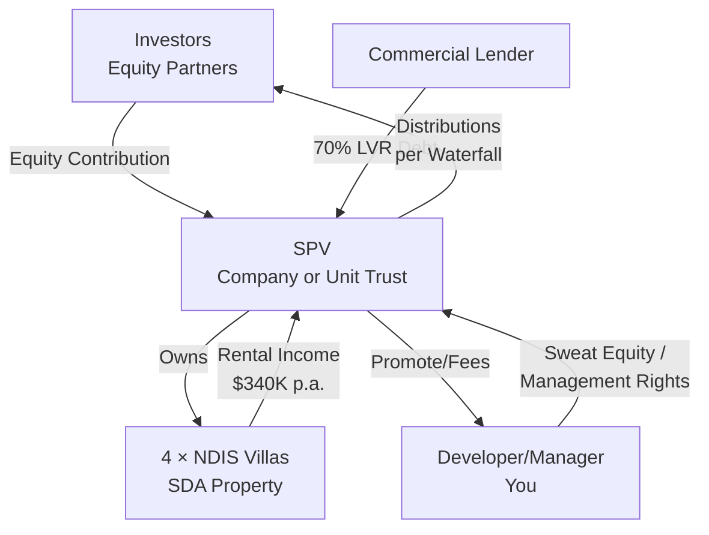
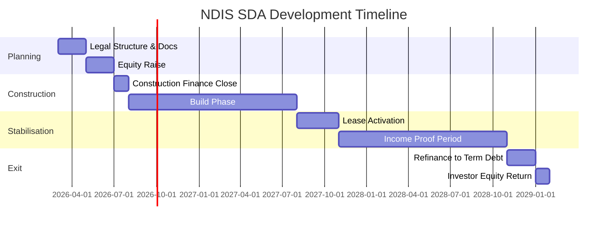

# Commercial Lending & NDIS Property Development Strategy

> **⚠️ STATUS: REFERENCE ONLY**  
> This document assumed a developer/manager role leading a multi-investor syndicate.  
> **The actual opportunity is a 3-way equity partnership.**  
> **See:** [05-three-way-partnership-analysis.md](05-three-way-partnership-analysis.md)

**Document Purpose:** Guide for QuadRise-Property team on commercial lending fundamentals and NDIS/SDA property investment strategy (developer/manager perspective).

**Date:** February 16, 2026  
**Status:** Reference Document (Original Strategy)  
**Target Audience:** Partners, Investors, Development Team (if pursuing developer role)

---

## Executive Summary

This document provides:

1. **Commercial lending fundamentals** for NDIS/SDA property development
2. **Financial structuring** for a 4-villa High Physical Support SDA project
3. **Partnership framework** for investor agreements
4. **Risk mitigation strategies** from Financial, Legal, and Investment perspectives

### Project Overview (Case Study)

- **Asset Type:** 4 × NDIS villas (High Physical Support category)
- **Build Cost:** $1.7M
- **Gross Income:** $340K p.a. ($85K per villa)
- **LVR Offered:** 70% (specialist lender)
- **Debt Quantum:** ~$1.19M
- **Equity Required:** ~$510K + costs

---

## Part 1: Commercial Lending Fundamentals

### 1.1 How Commercial Lenders Assess NDIS/SDA Projects

Unlike residential mortgages, commercial lenders focus on **asset income**, not personal serviceability.

#### Key Assessment Criteria

| Metric | Typical Threshold | Our Project |
| ------ | ----------------- | ------------- |
| **LVR (Loan-to-Value Ratio)** | 60-65% (standard SDA)<br>70% (High Physical Support) | **70%** ✓ |
| **DSCR (Debt Service Coverage Ratio)** | ≥1.25 minimum | **~3.0** ✓✓ |
| **Income Shading** | 70-85% of gross rent | 80% (HPS category) |
| **Lease Strength** | Head lease preferred | Specialist SDA provider ✓ |

#### DSCR Calculation Example

```calc
Assessable Income: $340K × 80% = $272K
Annual Interest (10%): $1.19M × 10% = $119K

DSCR = $272K / $119K = 2.29

Result: STRONG (well above 1.25 minimum)
```

**Financial Advisor Insight:**  
A DSCR above 2.0 provides significant safety margin for:

- Interest rate rises
- Vacancy periods  
- SDA payment changes
- Refinancing flexibility

---

### 1.2 Why High Physical Support (HPS) Improves Lending Terms

**Property Investment Strategist Analysis:**

| Factor | Impact on Lending |
| -------- | ------------------ |
| **Highest SDA payment band** | Premium rent = stronger DSCR |
| **Low tenant churn** | Reduced vacancy risk |
| **Long dwell times** | Predictable cashflow |
| **High replacement cost** | Asset defensibility |
| **Specialist operators only** | Quality tenant screening |

Lenders treat HPS SDA properties as **quasi-infrastructure assets**, not vanilla residential.

**Result:** Higher LVR, better rates, longer interest-only periods.

---

### 1.3 Two-Phase Financing Structure

**CRITICAL:** Understand the distinction between construction and term debt.

#### Phase 1: Construction Finance

| Feature | Details |
| --------- | --------- |
| **Purpose** | Fund build-out to completion |
| **LVR** | Often 65% during construction |
| **Rate** | Higher (construction risk premium) |
| **Drawdowns** | Progressive (tied to QS reports) |
| **Requirements** | • Fixed-price contract<br>• 5-10% contingency<br>• Personal guarantees |

#### Phase 2: Term Debt (Post-Completion)

| Feature | Details |
| --------- | --------- |
| **Purpose** | Refinance to stabilised asset lending |
| **LVR** | Can increase to 70% post-stabilisation |
| **Rate** | Lower (income-proven, lower risk) |
| **Structure** | Interest-only for 5-10 years |
| **Guarantees** | Often reduced or removed |

**Legal Advisor Note:**  
Plan your "exit lender" (term debt provider) *before* arranging construction finance. Many developers fail to secure favourable refinance terms due to poor documentation during build phase.

---

## Part 2: Financial Structuring & Partner Waterfall

### 2.1 Single Purpose Vehicle (SPV) Structure

**Lender Requirement:** Project must be held in a clean SPV.



**Legal Structure Options:**

| Structure | Tax Treatment | Lender Preference | Complexity |
| ----------- | -------------- | ------------------ | ------------ |
| **Company** | Corporate tax (30%)<br>Franking credits | Slightly preferred<br>(cleaner guarantees) | Low |
| **Unit Trust** | Flow-through<br>(taxed at investor level) | Acceptable | Medium |

**Financial Advisor Recommendation:**  
Unit Trust structure typically provides better tax efficiency for high-income investors, particularly for negative gearing during construction phase.

---

### 2.2 Lender-Proof Distribution Waterfall

This is the **core mechanism** that protects lender cashflow while delivering investor returns.

#### Distribution Waterfall (Shareholder/Unitholder Agreement)

All income received by the SPV must be applied in the following **strict order:**

---

**1️⃣ Gross Income**  
All SDA rental income flows into SPV operating account.

---

**2️⃣ Operating Expenses**  
Pay all costs before any distributions:

- SDA provider fees
- Property and tenancy management
- Insurance (public liability, building, landlord)
- Maintenance and repairs
- Rates, land tax, utilities
- Accounting, audit, compliance costs

---

**3️⃣ Senior Debt Obligations** ⚠️  
**NON-NEGOTIABLE:** Lender is paid before anyone else.

- Interest payments (and principal if P&I)
- Facility fees and charges
- **No distributions may occur if debt service is not fully met**

---

**4️⃣ Reserve Accounts**  
Mandatory cashflow buffers:

- **Interest reserve:** 3-6 months of debt service
- **Maintenance/Capex reserve:** Ongoing repairs
- **Vacancy buffer:** (if required by lender)

---

**5️⃣ Preferred Return to Investors** *(Optional but Recommended)*  

- **6-8% per annum** on unreturned contributed equity
- **Non-compounding** (does not accrue if unpaid)
- **Only paid if DSCR ≥ 1.25** (covenant protection)

---

**6️⃣ Residual Cash Distribution (Profit Split)**  
Any remaining cashflow distributed as:

- **70%** to Investors (pro-rata to equity)
- **30%** to Developer/Manager (promote)

*Alternative: Tiered promote (e.g., 70/30 until 15% IRR, then 50/50)*

---

**7️⃣ Distribution Lock-Up** 🔒  
**No distributions permitted if:**

- ❌ DSCR below 1.25 (or lender covenant)
- ❌ LVR breach
- ❌ Event of default
- ❌ Construction cost overrun not fully funded

---

### 2.3 What Lenders Hate (Avoid These)

**Legal Advisor Warning:**

| ❌ Forbidden Structure | Why Lenders Reject It |
| ---------------------- | ---------------------- |
| Guaranteed investor returns regardless of cashflow | Creates equity that behaves like senior debt |
| Fixed monthly distributions | Ignores DSCR fluctuations |
| Partner loans ranking ahead of bank | Subordination conflict |
| Investor veto over refinancing | Prevents lender enforcement |
| Complex IRR waterfalls pre-debt service | Opaque, unpredictable |

**Key Principle:** Keep it **simple, transparent, and debt-service-first.**

---

## Part 3: Investor Agreement Framework

### 3.1 What Form Does the Agreement Take?

For a $1.7M NDIS development with multiple partners, you need:

#### Core Documents

| Document | Purpose | Owner |
| ---------- | --------- | ------- |
| **Information Memorandum (IM)** | Detailed project overview, risks, returns | Developer (You) |
| **Subscription Agreement** | Investor commits capital, acknowledges risks | Each Investor signs |
| **Shareholder/Unitholder Agreement** | Governance, waterfall, exits, decision rights | All parties |
| **SPV Constitution** | Legal formation of Company/Trust | Lawyer drafts |

---

### 3.2 Compliance: Avoiding Regulatory Traps

**Legal Advisor Critical Note:**

If structured incorrectly, you could be issuing a **managed investment scheme** requiring:

- AFSL (Australian Financial Services License)
- Compliance with Corporations Act Ch 5C
- Significant legal and ongoing costs

#### How to Stay Compliant (Safe Harbour)

✅ **Offer to:**

- Sophisticated investors (s708 exemption), OR
- Maximum 20 investors in 12 months (small-scale offering)

✅ **Do NOT:**

- Advertise publicly
- Guarantee returns
- Pool funds without proper structure

✅ **Do:**

- Provide detailed risk disclosure
- Use proper legal documentation
- Maintain clear SPV separation

**Recommendation:** Engage a corporate/securities lawyer for IM and subscription docs (~$5-10K investment that protects $1.7M deal).

---

### 3.3 Responsibilities: Who Does What

#### Developer/Manager (You)

**Control & Obligations:**

- ✓ Control development and construction
- ✓ Appoint builder, consultants, property manager
- ✓ Liaise with lender and SDA provider
- ✓ Manage refinance and stabilisation
- ✓ Owe **fiduciary duties** (act in SPV's best interest)

**What You Do NOT Guarantee:**

- ✗ Profit outcomes
- ✗ Rental guarantees (unless explicitly via separate deed)
- ✗ Protection from market changes

---

#### Investors (Equity Partners)

**Rights & Limitations:**

- ✓ Provide equity capital only
- ✓ Receive distributions per waterfall
- ✓ Limited liability (to capital contributed)
- ✗ **No day-to-day control** over operations
- ✗ **No personal guarantees** (unless explicitly agreed)

**Decision Rights (Requiring Investor Approval):**

- Sale of the property (typically 75% majority)
- Major refinancing outside business plan
- Material change to SDA provider or lease terms

**Prohibited Veto Rights:**

- ✗ Routine property management
- ✗ Lender enforcement or refinance for compliance
- ✗ Appointment of builder or consultants

**Financial Advisor Note:**  
Investors providing guarantees (if required) should receive **guarantee fee** (e.g., 1-2% p.a. on guaranteed amount) or additional equity upside.

---

### 3.4 Personal Guarantees (The Uncomfortable Truth)

#### During Construction Phase

**Expectation:** Lender will require guarantees from:

- Developer/Manager (you) — **almost certain**
- Major equity investors (>25% stake) — **common**

**Structure:**

- Joint & several (each guarantor liable for full debt), OR
- Limited/proportional (capped at equity percentage)

#### Post-Stabilisation / Refinance

Once property is:

- ✓ Built and certified
- ✓ Leased to SDA provider
- ✓ Income proven for 6-12 months

Guarantees can often be:

- **Reduced** (e.g., from unlimited to capped)
- **Limited** (joint → several only)
- **Removed** entirely (if DSCR and LVR allow)

**Legal Advisor Strategy:**  
Negotiate guarantee release conditions **upfront** in construction loan docs. Common trigger: DSCR >1.4 for 12 consecutive months.

---

### 3.5 Exit Mechanics (Critical for Investor Certainty)

Investor Agreement must clearly define how partners exit.

#### Exit Pathway 1: Refinance (Primary Strategy)

**Timeline:** Post-stabilisation (12-24 months post-completion)

**Mechanism:**

- Refinance from construction debt to term debt
- Potentially increase LVR from 65% → 70%
- Return **part or all** investor equity
- Continue operating with long-term IO debt

**Example:**

```
Completed Value (stabilised): $2.0M
Refinance LVR: 70%
New Debt: $1.4M
Existing Debt: $1.19M

Available for Return: $1.4M - $1.19M = $210K
(Can return ~40% of investor equity while keeping property)
```

---

#### Exit Pathway 2: Sale

**Trigger:** By investor vote after minimum hold period (e.g., 5-7 years)

**Voting Threshold:**

- **Special resolution:** 75% of equity votes required
- Protects against single investor forcing premature sale

**Waterfall on Sale:**

1. Repay lender
2. Return investor capital
3. Preferred return arrears (if any)
4. Remaining profit per profit-split ratio (70/30)

---

#### Exit Pathway 3: Drag-Along / Tag-Along Rights

**Drag-Along (Majority Protection):**

- If 75%+ vote to sell, **all investors must sell**
- Prevents minority blocking value-realisation

**Tag-Along (Minority Protection):**

- If majority sells their stake to third party, **minority can join sale** on same terms
- Prevents being trapped with unknown partner

---

#### What is NOT Permitted (Protects Bankability)

❌ **Forced redemption:** Investors cannot demand early capital return  
❌ **Hostile exits:** No unilateral withdrawal rights  
❌ **Liquidity events:** Only via refinance or sale (no secondary market)

**Property Investment Strategist Note:**  
NDIS/SDA is a **long-term hold strategy**. Investors must have 5-7 year horizon. Market for pre-stabilisation SDA assets is thin—exit via refinance or stabilised sale only.

---

## Part 4: Risk Analysis & Mitigation

### 4.1 SWOT Analysis

#### Strengths

- ✅ **Strong DSCR** (~2.3)
- ✅ **High Physical Support category** (premium SDA band)
- ✅ **Specialist SDA provider** (reduces operational risk)
- ✅ **70% LVR confirmed** (best-in-class for SDA)
- ✅ **Stable, long-term income** (infrastructure-like cashflow)

#### Weaknesses

- ⚠️ **Construction execution risk** (cost blowouts, delays)
- ⚠️ **Personal guarantee exposure** during build phase
- ⚠️ **Liquidity constraints** for investors (5-7 year hold)
- ⚠️ **Specialist market** (smaller buyer pool on exit)

#### Opportunities

- 🎯 **NDIS undersupply** in HPS category
- 🎯 **Government-backed income** (NDIS scheme stability)
- 🎯 **Scale potential** (prove model, replicate)
- 🎯 **Favourable policy environment** (SDA still prioritised)

#### Threats

- 🔴 **NDIS scheme changes** (payment reductions, policy shifts)
- 🔴 **Provider default or deregistration**
- 🔴 **Interest rate volatility** (impacts refi terms)
- 🔴 **Construction cost inflation** (materials, labour)

---

### 4.2 Risk Mitigation Matrix

| Risk | Likelihood | Impact | Mitigation Strategy |
| ------ | ----------- | -------- | --------------------- |
| **SDA payment reduction** | Low | High | • Diversify across multiple villas<br>• HPS least likely to be cut<br>• Monitor NDIA consultations |
| **Construction cost overrun** | Medium | High | • Fixed-price contract (non-negotiable)<br>• 10% contingency buffer<br>• QS reports at each milestone |
| **Provider default** | Low | Medium | • Head lease with established operator<br>• NDIS registration verified<br>• Financial health checks |
| **Interest rate rise** | Medium | Medium | • DSCR buffer (3.0 vs 1.25 minimum)<br>• Lock rate during construction<br>• Model scenarios at +2% |
| **Vacancy / tenant churn** | Low | Medium | • HPS = low churn demographic<br>• Specialist provider = quality matching<br>• 3-month vacancy buffer in reserves |
| **Refinance rejection** | Low | High | • Pre-negotiate term debt lender<br>• Maintain DSCR > 1.4<br>• Document income for 12+ months |

---

### 4.3 Stress Testing

**Financial Advisor Requirement:** Model downside scenarios before committing.

#### Scenario 1: Interest Rate Rise (+2%)

```
New Rate: 12%
Annual Interest: $1.19M × 12% = $142.8K

DSCR = $272K / $142.8K = 1.9

Result: Still well above 1.25 minimum ✓
```

#### Scenario 2: One Villa Vacant (25% Income Loss)

```
Reduced Income: $340K × 75% × 80% = $204K
Interest (10%): $119K

DSCR = $204K / $119K = 1.71

Result: Still acceptable ✓
```

#### Scenario 3: Combined (Rate Rise + Vacancy)

```
Income: $204K
Interest (12%): $142.8K

DSCR = $204K / $142.8K = 1.43

Result: Above 1.25, but tighter—maintain reserves ⚠️
```

**Conclusion:** Deal has significant safety margin even under stress.

---

## Part 5: Execution Checklist

### 5.1 Pre-Finance (Immediate Actions)

- [ ] **SDA Certification & Compliance**
  - [ ] Obtain design certification for High Physical Support
  - [ ] Verify compliance with SDA Design Standard
  - [ ] Confirm council/planning approvals

- [ ] **SDA Provider Due Diligence**
  - [ ] Verify NDIS provider registration
  - [ ] Check financial stability and track record
  - [ ] Draft Heads of Agreement for head lease or management

- [ ] **Legal Structure**
  - [ ] Engage corporate lawyer (securities experience)
  - [ ] Form SPV (Company or Unit Trust)
  - [ ] Draft shareholder/unitholder agreement (with waterfall)
  - [ ] Prepare Information Memorandum

- [ ] **Financial Modelling**
  - [ ] Stress-test cashflow scenarios
  - [ ] Model refinance economics (post-stabilisation)
  - [ ] Calculate investor IRR under base/stress cases

---

### 5.2 Construction Finance Phase

- [ ] **Lender Documentation**
  - [ ] Fixed-price building contract (non-negotiable)
  - [ ] Quantity Surveyor (QS) reports schedule
  - [ ] Personal guarantee terms negotiated
  - [ ] Guarantee release conditions documented

- [ ] **Equity Call**
  - [ ] Investor subscription agreements signed
  - [ ] Equity contributions banked (staged or upfront)
  - [ ] Reserve accounts established (interest, capex)

- [ ] **Build Monitoring**
  - [ ] Monthly site inspections
  - [ ] QS certification for drawdowns
  - [ ] Contingency tracking
  - [ ] Lender reporting (monthly/quarterly)

---

### 5.3 Stabilisation & Refinance Phase

- [ ] **Lease Activation**
  - [ ] Head lease executed with SDA provider
  - [ ] First tenants placed (NDIS participants)
  - [ ] Income collection verified (6-12 months)

- [ ] **Refinance Preparation**
  - [ ] Approach term debt lenders (6 months before construction loan maturity)
  - [ ] Provide income proof (rent rolls, SDA payments)
  - [ ] Negotiate guarantee release or reduction
  - [ ] Target 70% LVR, IO for 5-10 years

- [ ] **Investor Returns**
  - [ ] Distribute preferred returns (if cashflow permits)
  - [ ] Consider partial equity return via refinance proceeds
  - [ ] Provide audited financials and performance report

---

### 5.4 Ongoing Management

- [ ] **Quarterly Reporting to Investors**
  - [ ] Income vs budget
  - [ ] Occupancy rates
  - [ ] Maintenance spend
  - [ ] DSCR and covenant compliance

- [ ] **Annual Reviews**
  - [ ] SDA payment rate changes (NDIS pricing reviews)
  - [ ] Insurance renewals
  - [ ] Tax compliance (returns, distributions)
  - [ ] Strategic review (hold vs sell vs refinance)

---

## Part 6: Key Takeaways for the Team

### For Financial Partners / Investors

✅ **This is a strong deal:**

- DSCR of ~2.3 is strong (most lenders want ≥1.25)
- 70% LVR is best-in-class for SDA
- High Physical Support = premium, stable income

⚠️ **But understand:**

- Liquidity is limited (5-7 year hold expected)
- Construction guarantees may be required
- Returns come from distributions + capital growth, not guaranteed

📊 **Expected Returns (Indicative):**

- Preferred return: 6-8% p.a. on equity
- Profit share post-preferred: 70% to investors
- Exit via refinance or sale (not before stabilisation)

---

### For Developer / Manager (You)

✅ **Your value creation:**

- Sourcing the deal
- Managing construction
- Achieving stabilisation
- Delivering refinance or sale exit

💰 **Your compensation:**

- Development fee (typically 3-5% of build cost)
- Management fee during operation (optional)
- Promote on profits (e.g., 30% of residual cashflow)

⚠️ **Your exposure:**

- Personal guarantees during construction (plan for release post-refi)
- Fiduciary duty to SPV and investors
- Reputation risk if execution fails

---

### For the Team (Collective)

🎯 **Critical Success Factors:**

1. **Clean structure:** Simple SPV, clear waterfall, lender-first
2. **Fixed-price contract:** Non-negotiable for construction phase
3. **Specialist provider:** Head lease with registered, reputable SDA operator
4. **Reserve buffers:** 3-6 months interest, capex, vacancy coverage
5. **Exit clarity:** Refinance pathway planned from day one

⚠️ **Do NOT:**

- Overcomplicate the waterfall (lenders hate complexity)
- Guarantee investor returns (creates regulatory and financial risk)
- Skip legal docs (IM, subscription, shareholder agreement = essential)
- Underestimate construction contingency (10% minimum)

---

## Part 7: Next Steps

### Current Status (March 2026)

✅ **In Progress:**

- **NDIS Specialist Engagement:** Currently engaging with NDIS property development specialist
- **Market Research:** Gathering intelligence on HPS SDA opportunities and market dynamics
- **Strategy Validation:** Reviewing feasibility and risk mitigation approaches

### Questions for NDIS Specialist

**Strategic & Market Questions:**

1. What are the current HPS SDA vacancy rates in target markets (SEQ/regional QLD)?
2. Which locations have the highest demand vs supply gap for HPS category?
3. What is the typical timeline from construction completion to tenant placement?

**Provider & Operational Questions:**

1. Which SDA providers are most reputable and financially stable in QLD?
2. What are typical head lease terms (duration, break clauses, rent review mechanisms)?
3. Do providers prefer head leases vs property management models? What are the trade-offs?
4. What property management fees are standard for SDA (as % of gross rent)?
5. What are the most common operational issues that cause provider-landlord disputes?

**Design & Compliance Questions:**

1. What are the most critical design features lenders and providers prioritize for HPS?
2. Are there oversupplied design types we should avoid (e.g., too many 4-bedroom villas)?
3. What is the certification process timeline and cost for HPS SDA properties?
4. What are common compliance failures that delay certification?

**Financial & Funding Questions:**

1. Which lenders are currently most active and competitive for HPS SDA construction finance?
2. What LVR and interest rates are realistic in current market (March 2026)?
3. Are lenders still offering 70% LVR for HPS, or has this tightened?
4. What DSCR thresholds are lenders requiring for SDA projects now?
5. Are there any government grants or incentives still available for SDA development?

**Risk & Exit Questions:**

1. What is the average hold period before investors typically exit SDA projects?
2. How liquid is the market for stabilized HPS SDA properties (ease of sale)?
3. What buyer profile typically acquires SDA assets (institutional, private, SMSF)?
4. Have you seen any SDA projects fail or require distressed sales? What were the causes?
5. What is your view on interest rate risk and impact on SDA valuations?

**Partnership & Structure Questions:**

1. Do you have trusted partners you recommend for: builders, solicitors, accountants, QS?
2. What equity partnership structures have you seen work best for SDA developments?
3. Are there any regulatory "gotchas" we should be aware of when structuring the SPV?
4. Do you offer ongoing advisory/support during construction and stabilization phases?
5. Are you aware of any existing SDA projects seeking co-investors or JV partners?

**Additional Notes/Follow-Up:**

- [ ] Request case studies of similar HPS projects (anonymized financials, timelines, outcomes)
- [ ] Ask for introduction to preferred SDA provider for initial discussions
- [ ] Obtain referrals for construction finance brokers specializing in SDA
- [ ] Clarify ongoing advisory fees and scope of services

---

### Immediate Actions (Post-NDIS Specialist Meeting)

1. **Legal Advisor:** Engage corporate lawyer with securities/fundraising experience
2. **Financial Advisor:** Engage accountant for SPV tax structure advice
3. **Property Analysis:** Validate target location based on specialist's demand insights
4. **Provider Outreach:** Initiate discussions with recommended SDA providers

### Short-Term (Month 1-3)

1. **Finalise SPV structure** (Company vs Unit Trust decision)
2. **Draft and circulate Information Memorandum** to potential investors
3. **Negotiate Heads of Agreement** with SDA provider (head lease)
4. **Secure fixed-price building contract** with reputable builder
5. **Approach construction finance lenders** (via specialist broker if recommended)

### Medium-Term (Month 3-6)

1. **Close equity raise** (subscription agreements signed, capital called)
2. **Execute construction finance** (drawdown facility, guarantees in place)
3. **Commence construction** (QS reports, progress monitoring)
4. **Maintain regular communication** with SDA provider and NDIS specialist

---

## Appendices

### Appendix A: Glossary of Terms

| Term | Definition |
| ------ | ------------ |
| **DSCR** | Debt Service Coverage Ratio. Income ÷ Debt Service. Measures ability to service loan. |
| **LVR** | Loan-to-Value Ratio. Loan Amount ÷ Asset Value. Measures leverage. |
| **SDA** | Specialist Disability Accommodation. NDIS-funded housing for high-need participants. |
| **HPS** | High Physical Support. Highest SDA design category (highest payment rates). |
| **SPV** | Special Purpose Vehicle. Separate legal entity to hold single project. |
| **IO** | Interest-Only. Loan structure where only interest is paid (no principal repayment). |
| **QS** | Quantity Surveyor. Certifies construction progress for lender drawdowns. |
| **Promote** | Developer's share of profits beyond base return (performance incentive). |

---

### Appendix B: Indicative Timeline



---

### Appendix C: Document Templates Required

**Immediately:**

- [ ] Information Memorandum (IM)
- [ ] Subscription Agreement (per investor)
- [ ] Shareholder/Unitholder Agreement (with waterfall clause)

**During Construction:**

- [ ] Fixed-Price Building Contract
- [ ] Loan Facility Agreement (construction debt)
- [ ] Personal Guarantee Deeds
- [ ] QS Milestone Reports

**Post-Completion:**

- [ ] Head Lease Agreement (SDA provider)
- [ ] Property Management Agreement
- [ ] Refinance Loan Docs (term debt)

---

## Mandatory Disclaimer

⚠️ **CRITICAL:**

This document is for **strategic planning purposes only** and does not constitute:

- Financial product advice
- Legal advice
- Tax advice
- Investment recommendation

**You MUST obtain independent professional advice from:**

- Licensed Financial Planner (AFSL holder)
- Corporate/Securities Lawyer
- Chartered Accountant (tax structuring)
- SDA/NDIS Specialist Consultant

**No guarantees** are made regarding:

- Lending outcomes
- Investment returns
- NDIS scheme stability
- Regulatory compliance

All parties must conduct their own due diligence and seek qualified professional advice before committing capital or executing agreements.

---

**Document Control:**

- **Version:** 1.0
- **Author:** QuadRise-Property Strategic Planning
- **Review Date:** March 2026
- **Next Update:** Post-legal and financial advisor review
